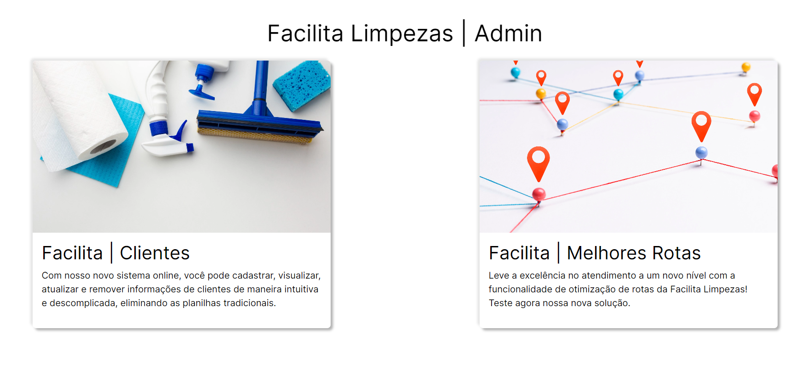
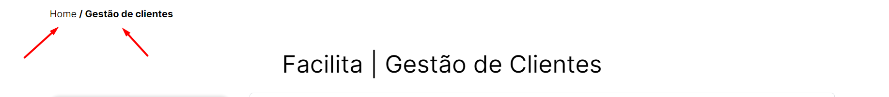
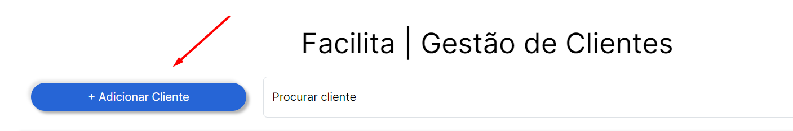
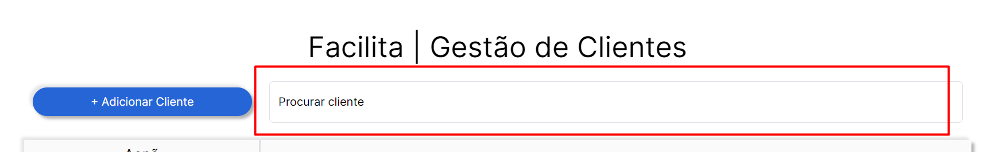
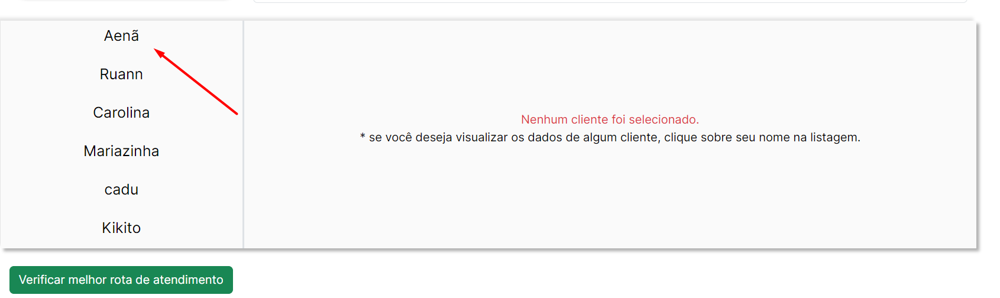
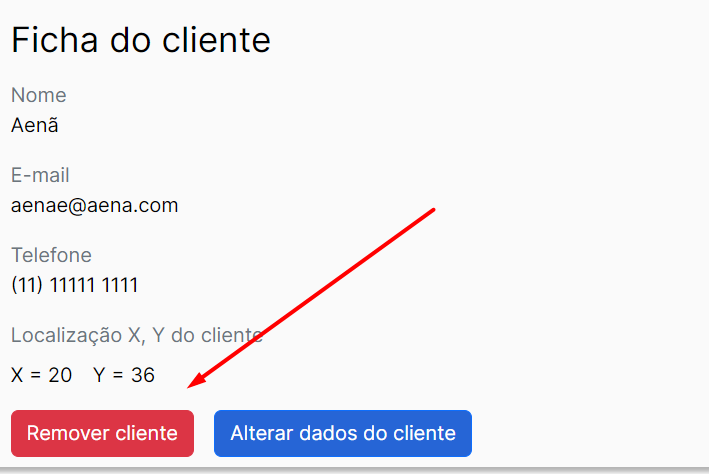
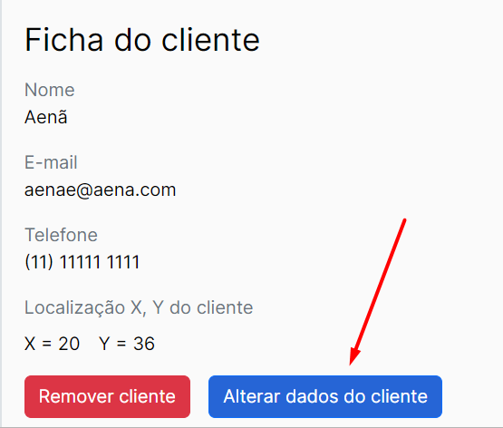
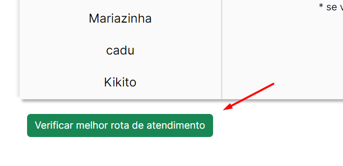
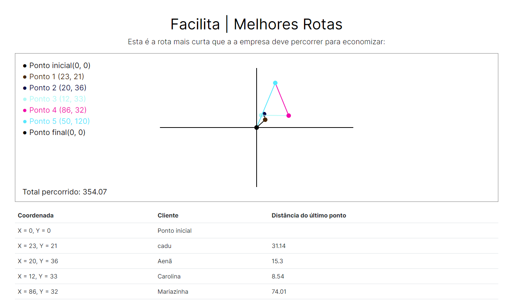
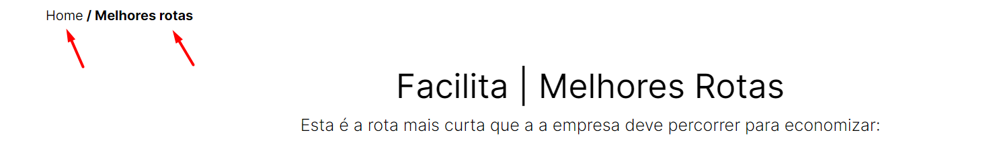

<h1>Facilita - Teste técnico</h1> 

<h2>Como rodar o projeto?</h2>
<ul>
  <li>O projeto está rodando em produção no seguinte domínio: <a target="_blank" href="https://facilitalimpezas.vercel.app">https://facilitalimpezas.vercel.app</a></li>
  <li>Caso queria rodar o projeto localmente, basta seguir o seguinte passo a passo: </li>
  <ol>
    <li>Utilizar a versão 18.17.0 do nodejs e a versão 14.1.0 do Next</li>
    <li>Clonar o repositório em sua máquina</li>
    <li>Instalar os pacotes npm</li>
    <li>Criar um .env e inserir as variáveis de ambiente que foram enviadas por e-mail</li>
  </ol>
</ul>

<h2>Fluxo do Sistema</h2>
  <ul>
  <li>Home</li>
    <ul>
      <li>Na home você poderá navegar, clicando em cada card, para a página gestão de clientes ou para a página de melhores rotas de atendimento, conforme imagem</li>
      
    </ul>
  <li>Gestão de Clientes</li>
    
Nest página será possível criar um novo cliente, filtrar a lista de clientes, visualizar, editar ou excluir um cliente, navegar entre telas e verificar a melhor rota de atendimento.

    <ul>
      <li>Navegar entre telas - clicar na tela que deseja na navbar</li>
      
       <li>Adicionar cliente - clicar no botão + Adicionar Cliente e preencher os dados do formulário</li>
      
      <li>Filtrar a lista de clientes - digitar o nome, telefone ou e-mail do cliente no campo demarcado</li>
      
        <li>Visualizar um cliente - clique no nome dele</li>
        
      <li>Remover cliente - clique no botão Remover Cliente</li>
        
      <li>Alterar dados do cliente - clique no botão Alterar dados do cliente. Isso irá trocar a visualização da ficha e você poderá alterar os dados dele no formulário e salvar</li>
        
      <li>Visualizar a melhor rota de atendimento - clique no botão Verificar melhor rota de atendimento e o modal de visualização irá aparecer</li>
        
    </ul>  
  <li>Melhores Rotas</li>
    
Nest página é possível visualizar a melhor rota de atendimento e navegar entre telas

    <ul>
      <li>Visualizar rota de atendimento - Somente entrar na página</li>
      
      <li>Navegar entre telas - clicar na tela que deseja na navbar</li>
      
      </ul> 
  </ul>
  

<h2>DDL</h2>
<code>CREATE TABLE customers (
    id SERIAL PRIMARY KEY,
    name VARCHAR(50) NOT NULL,
    email VARCHAR(50) NOT NULL UNIQUE,
    phone VARCHAR(22) NOT NULL,
    location JSON NOT NULL
);</code>

<h2>Observação</h2>

O banco de dados postgresql utilizado está armazenado na nuvem no serviço AWS RDS

